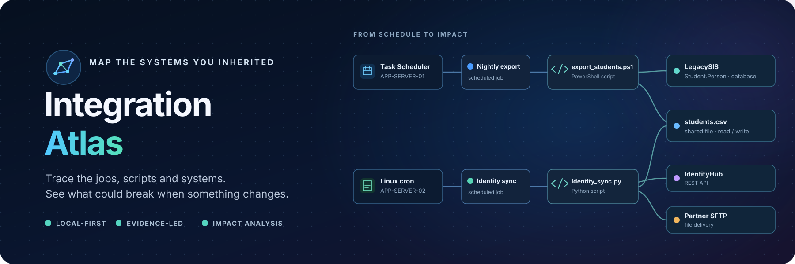

# 🗺️ Integration Atlas



> **Map the systems, scripts, databases, files and APIs hidden inside your
> integration estate — then see what could break when something changes.**

[](https://python.org)
[](https://github.com/ikelaiah/integration-atlas/blob/main/LICENSE)

[📚 Documentation](https://ikelaiah.github.io/integration-atlas/) · [🧭 Northstar walkthrough](https://ikelaiah.github.io/integration-atlas/northstar-walkthrough.html)

You inherited a folder of PowerShell jobs, a database nobody understands, three
CSV exports that feed systems you have never seen, and a note that says *"don't
touch the student export"*.

Integration Atlas reads those artefacts and reconstructs the map — with
evidence for every edge — so you can answer the question that actually matters:

> *If I change `Student.Person.StudentID`, what breaks?*

🏠 Local-first. 🚫 No agents, no telemetry, no Kubernetes, no admin access required.

---

## 😵 The problem

Enterprise integration knowledge lives in scripts, not documentation.

* The scheduler export names a script. The script queries a table. The table
  feeds a file. The file goes over SFTP to a vendor. Nobody wrote it down.
* Two unrelated integrations quietly consume the same CSV.
* A server is referenced by seventeen jobs and appears in no runbook.
* Every change is a guess about blast radius.

Static analysis of the artefacts you already have recovers most of that map.

## ⚙️ How it works

```text
Discover  →  Extract  →  Normalise  →  Link  →  Visualise  →  Analyse
```

Point it at a folder. It walks the tree, hands each file to the scanners that
claim it, turns observations into entities and relationships **with evidence**,
and renders the result as an interactive dependency graph.

🧊 Everything is static. Nothing is executed, nothing is uploaded.

## ✨ Features

🧭 **Discovery** — Python, PowerShell, SQL, JSON, YAML, XML, INI, `.env`,
Windows Task Scheduler exports and cron. Finds embedded SQL, HTTP calls, file
IO, connection strings, UNC paths, hostnames and scheduler entries.

🔎 **Evidence, everywhere** — every relationship shows the file, the line and
the redacted snippet that produced it. If Atlas says `nightly-export.ps1 READS
FROM Student.Person`, you can see line 87 and the query.

🎯 **Honest confidence** — `Confirmed`, `High`, `Medium`, `Low`, `Manual`. No
relationship is asserted without provenance, and you can confirm or reject
what it finds.

💥 **Impact analysis** — select an entity, get the blast radius: the
integrations, scripts, jobs, files and external services downstream of a
change, with representative end-to-end flows.

🧵 **Dependency paths** — ask how `LegacySIS` reaches `EnrolmentPortal` and get
the actual chain, highlighted on the graph.

⚠️ **Explainable risk** — hard-coded credentials and IPs, UNC paths, deprecated
hosts, missing owners, undiscovered dependencies, dependency concentration.
Every finding names its rule and explains itself. No opaque scores.

🔒 **Secret redaction** — credentials are detected and masked at the parser
boundary. Nothing sensitive ever reaches the database, the logs or an export.

♻️ **Rescans that respect your work** — reconciles by natural key, reports what
added/changed/removed, never overwrites manual edits, and retires discoveries
that a scan confirms are gone.

🖥️ **Multi-server provenance** — collect each machine into a bundle with a
`server.json` manifest and Atlas scopes its tasks and local scripts to that
execution server, so identical names on different hosts never merge. See
[`docs/server-bundles.md`](docs/server-bundles.md).

## 🚀 Quick start

```bash
git clone https://github.com/ikelaiah/integration-atlas.git
cd integration-atlas
```

Docker is optional. For a local install, you need Python 3.11 or newer. To open
the web interface, also install Node.js 22 or newer. If you only need the CLI,
you can skip the frontend build steps below.

**Windows (PowerShell):**

```powershell
py -3.11 -m venv .venv
.\.venv\Scripts\Activate.ps1
python -m pip install -e .
```

**macOS or Linux:**

```bash
python3.11 -m venv .venv
source .venv/bin/activate
python -m pip install -e .
```

To build the web interface, run these commands from the project root:

```bash
npm --prefix frontend ci
npm --prefix frontend run build
```

Now load the sample estate and start Atlas:

```bash
atlas demo                         # load the Northstar demo estate
atlas serve                        # open http://localhost:8000
```

To scan your own files instead, keep them together in a folder and run:

```bash
atlas scan run ./my-integrations
atlas serve
```

In the web app, open **Scans**, enter a folder, and choose **Preview scan**.
The preview lists proposed additions, updates and retirements without changing
the workspace. Choose **Apply scan** to scan the current files and save the
actual result in scan history. Open **Review** to inspect relationship evidence
and confirm or reject discoveries. Select an entity in **Atlas** and choose
**Edit** to correct its description, owner, technology, location or environment.
These manual fields and review verdicts survive later rescans. Compare saved
graph states in **Compare graph history** to understand the net changes across
scans. See the [review workflow](docs/review-workflow.md) and
[comparison guide](docs/historical-comparison.md) for guided examples.

### 🎨 Frontend development

```bash
cd frontend
npm install
npm run dev                        # http://localhost:5173, proxies /api to :8000
```

For frontend development with hot reload, run `npm --prefix frontend run dev`
from the project root. The web interface opens at `http://localhost:5173` and
uses the local Atlas API on port 8000.

## 🎓 The demo estate

`atlas demo` loads **Northstar Education Group** — a fictional education group
built to look like a real one: a legacy DB2 student information system, a
modern enrolment portal, a finance ERP, SaaS systems, Windows scheduled jobs,
cron jobs, CSV drops over SFTP and REST integrations.

It includes the story this tool exists for:

```text
LegacySIS (DB2)
  └── Student.Person.StudentID
        ↓
  student_extract.sql
        ↓
  export_students.ps1  →  students.csv
                              │
              ┌───────────────┼────────────────┐
              ↓               ↓                ↓
      identity_sync.py   nightly_sync.py   learningcloud_export.ps1
              ↓               ↓                ↓
        IdentityHub     EnrolmentPortal    LearningCloud
```

Two independent integrations consume the same CSV. Select `StudentID`, press
**Impact analysis**, and see 39 downstream entities across 6 integrations — the
kind of dependency that is never in the documentation.

## ⌨️ CLI

```bash
atlas init                         # create the local database
atlas demo                         # load the demo estate
atlas scan run ./integrations      # discover from a folder
atlas status                       # workspace and estate totals
atlas impact StudentID             # what breaks if this changes?
atlas impact --json StudentID      # machine-readable
atlas export -f json -o out.json   # json | csv | graphml
atlas export -f mermaid -o atlas.mmd  # Mermaid diagram
atlas export -f plantuml -o atlas.puml # PlantUML diagram
atlas serve                        # start the web application
```

In **Atlas**, combine node type, environment, confidence, relationship type,
review status and text search to narrow the graph. **Find path** searches the
whole active workspace and explains the direction of influence. Use **Export**
to download the filtered graph as Mermaid or PlantUML. The
[navigation and sharing guide](docs/navigation-and-sharing.md) walks through
the Northstar example.

## 🔍 Supported scanners

| Artefact | Status | Detects |
|---|---|---|
| 🐍 Python | ✅ | embedded SQL, HTTP calls, file IO, subprocess, DB drivers, env vars, imports |
| 💠 PowerShell | ✅ | `Invoke-*`, `Sqlcmd`, file IO, UNC paths, URLs, exe invocations |
| 🗄️ SQL | ✅ | schemas, tables, columns, DML verbs, `EXEC`, stored procedures |
| ⚙️ JSON / YAML / XML / INI / `.env` | ✅ | URLs, hosts, ports, DB names, paths, connection strings |
| 🪟 Windows Task Scheduler XML | ✅ | task name, command, arguments, schedule, run-as |
| ⏰ cron / `/etc/cron.d` | ✅ | schedule, user, command |
| 🗓️ SQL Server Agent | 🗓 Phase 3 | |
| 🐙 GitHub Actions / Azure Automation | 🗓 Phase 3 | |

## 🏗️ Architecture

```text
backend/atlas/
├── api/            FastAPI routes + serialisers
├── scanners/       discovery plugins + walker + normaliser + runner
├── services/       graph, impact, search, risk, redaction, export
├── demo/           the Northstar estate + seeder
├── models.py       SQLAlchemy ORM (SQLite by default)
├── schemas.py      Pydantic contracts
└── domain.py       enums and semantics — the single source of vocabulary

frontend/src/       React + TypeScript + Tailwind + React Flow
examples/           realistic artefacts to point a scan at
tests/              regression and end-to-end tests with real fixtures
docs/               architecture, domain model, security, ADRs
```

Design rules that keep it maintainable: scanners never touch the database,
services never know about HTTP, and `domain.py` imports nothing from the rest
of the package. Full write-up in [`docs/architecture.md`](docs/architecture.md).

## 📸 Screenshots

| 🕸️ Atlas graph | 💥 Impact analysis |
| --- | --- |
| Interactive dependency map with type-coded nodes, hover dimming, focus mode and filters | Blast radius for `StudentID`, grouped by artefact type with representative end-to-end flows |

| 🔎 Evidence | 📊 Overview |
| --- | --- |
| Every relationship shows its source file, line and redacted snippet | Estate totals, discovery confidence and explainable risk highlights |

## ⚡ Performance

Designed for **10,000 entities / 50,000 relationships**. Graph payloads are
filtered server-side and capped; traversal is BFS over an adjacency index;
search is in-memory with a transparent, deterministic scorer.

## 🔒 Security

Full model in [`docs/security.md`](docs/security.md). The short version:

* 🏠 Local-first. No telemetry, no cloud upload, no external AI APIs.
* 🔏 Secrets are redacted at the parser boundary, before persistence. Leak tests
  assert that a known secret cannot survive anywhere in the output.
* 🧊 Scanners never execute or import scanned artefacts.
* 📁 Scan roots are explicit, optionally allowlisted, and resolved before use.
* 🛡️ Malformed files produce warnings, not crashes.

To report a security issue privately, follow [`SECURITY.md`](https://github.com/ikelaiah/integration-atlas/blob/main/SECURITY.md).

## 🗺️ Roadmap

**Phase 1** 🟢 — workspaces, filesystem discovery for Python,
PowerShell, SQL and config, secret redaction, normalised entity/relationship
model with evidence, SQLite, FastAPI, React graph UI, entity detail, search,
impact analysis, risk engine, demo estate.

**v0.2.0** 🟢 — scan preview and actual diff history, manual entity editing,
and an evidence-backed relationship review queue.

**v0.3.0** 🟢 — combined graph filters, full-workspace path search with
influence direction, and filtered Mermaid/PlantUML diagram export.

**v0.4.0** 🟢 — before/after graph checkpoints for applied scans, with
cross-scan net comparison and field-level change detail.

**Phase 3** 🔵 — SQL Server Agent scheduler exports, GitHub Actions and Azure
Automation workflow exports, PostgreSQL storage, team collaboration, and
authentication. These integrations read exported definitions; they do not
require installing an Atlas agent on source servers.

## 🤝 Contributing

Issues and pull requests are welcome.

```bash
pip install -e ".[dev]"
pytest                     # backend tests
cd frontend && npm run typecheck
```

Please:

* Keep discovery logic in `backend/atlas/scanners/` and out of the API layer.
* Add a test with a realistic fixture for any new scanner behaviour — tests
  that only assert mocks were called are not useful here.
* Preserve the rule that every discovered relationship carries evidence.
* Never commit real credentials. The fixtures use obviously-fake values.

The release quality bar and v0.1.0 checklist are in
[`docs/release-quality.md`](docs/release-quality.md).

## 📄 Licence

Apache 2.0 — see [LICENSE](https://github.com/ikelaiah/integration-atlas/blob/main/LICENSE).

---

> **Map the systems you inherited before you change the systems you inherited.**
